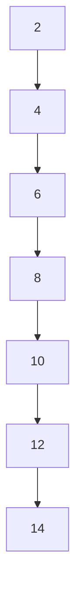
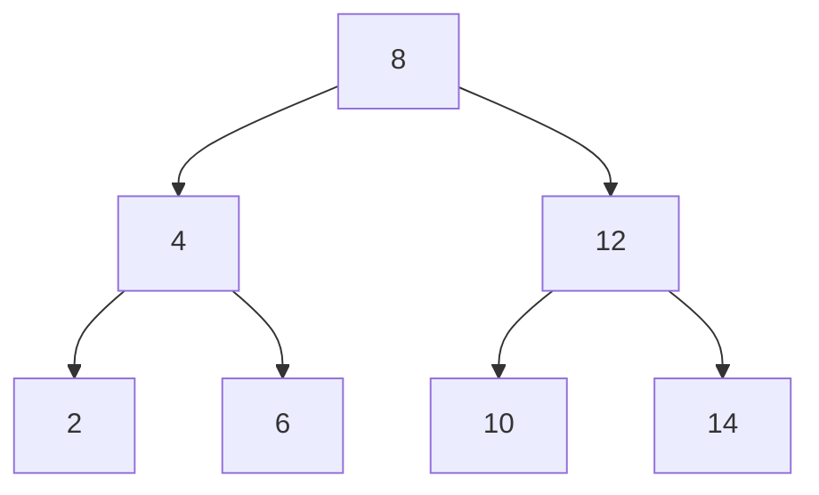
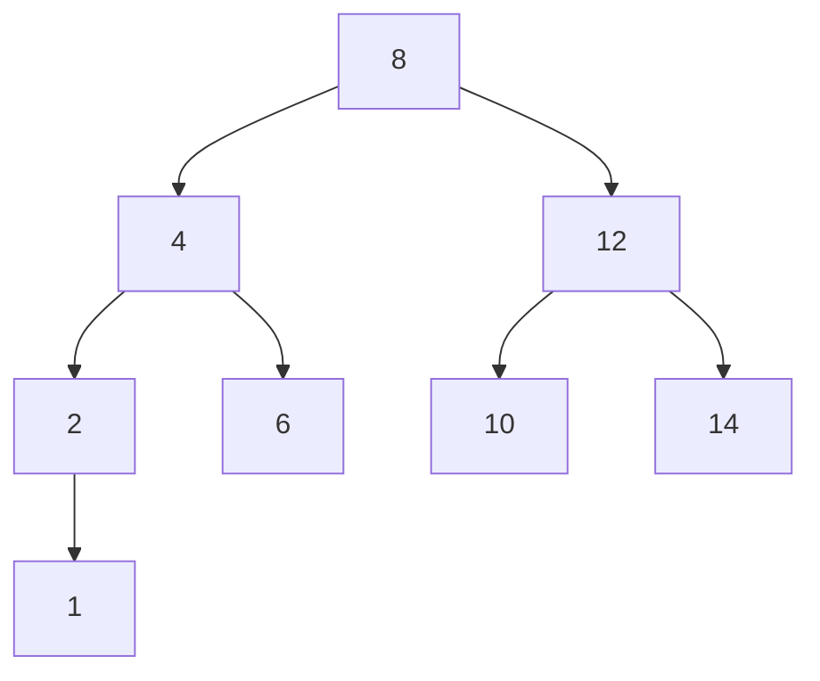
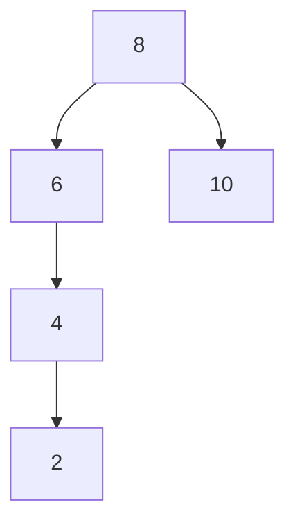
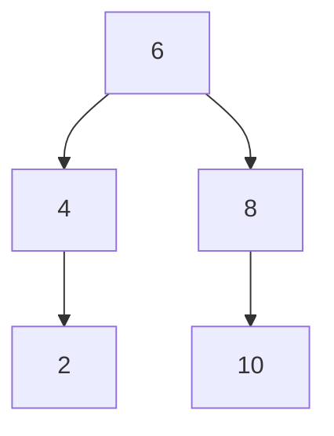
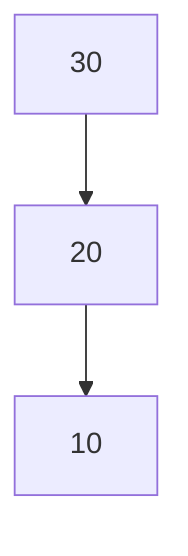
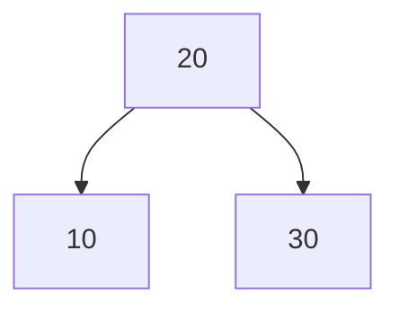
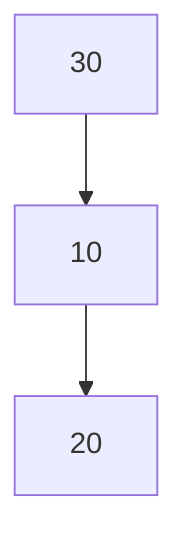
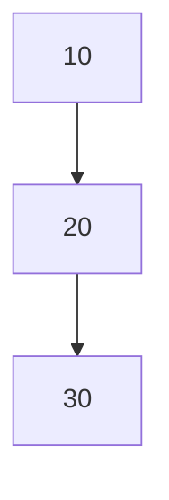

# AVL Trees: A Well-balanced Solution

## Introduction

- An **AVL tree** is a **self-balancing binary search tree**.
- The full form of AVL tree is **Adelson-Velsky and Landis tree**, as the tree is named after its creators Georgy Adelson-Velsky and Evgenii Landis.

## The concept of balancing

Take a look at this binary search tree:



- It is a normal tree that follows all of the rules
- However, because the nodes were inserted in ascending order, the tree consists solely of one branch
- As a result, it does not look like a tree but a linked list!

Compare this with the following tree, which has the same nodes:



- This tree is balanced, in all of the nodes have equally sized left and right branches
- This makes it more efficient than the previous tree

### Balance formula

The **balance of a node** is defined as the height of the left subtree minus the height of the right subtree:

$$
B(n) = H(T_L) - H(T_R)
$$

A balanced node is a node whose balance has an absolute value of at most 1:

$$
|B(n)| \le 1
$$

For example, in the following tree...



The balance of the root node is $B(8) = H(T_L) - H(T_R) = 2 - 1 = 1$. This means that the root node is a **balanced node**.

The same applies for all of the other nodes in this tree:

$$
B(2) = 0 - (-1) = 1\\
B(4) = 1 - 0 = 1\\
B(6) = -1 - (-1) = 0\\
B(10) = -1 - (-1) = 0\\
B(12) = 0 - 0 = 0\\
B(14) = -1 - (-1) = 0\\
$$

- For every node in this tree, $|B(n)| \le 1$, therefore every node is **balanced**
- This makes the tree not just any other binary search tree, but an **AVL tree**

On the other hand, look at this tree:



- Here, the balance of the root node is $B(8) = 2 - 0 = 2$
- Therefore, because $|B(8)| > 1$, not all of the nodes in the tree are balanced
- This is NOT an AVL tree

> **Note:** When a node is **left-heavy**, i.e. the left subtree has a greater height than the right ($H(T_L) \ge H(T_R) + 2$), the balance is **positive**. When it is **right-heavy**, i.e. $H(T_R) \ge H(T_L) + 2$, the balance is **negative**. This is the nature of the balance formula.

## Rotations

- So, every time we insert a node into an AVL tree, we have to make sure that all of the nodes are balanced
- We can do this be recursively visiting all of the ancestor nodes of the newly inserted node
- However, the actual balancing happens via **rotations**, which are **operations on a binary tree that change the structure without interfering with the order of the elements**

For example, the imbalanced tree above is balanced after performing the following **right rotation:**



This is now an AVL tree.

## Rotation cases

- Whenever we insert a node into the tree, there are 4 different ways that the tree can become imbalanced
- In each of these scenarios, we can perform one or two rotations to balance the subtree

The following are the four cases and the corresponding ways of balancing:

### 1. Left-Left (LL) Case: Single Right Rotation

Imbalance: Left child of left subtree is too deep.

Rotation: Right rotation on the unbalanced node.

Before Rotation:



After Rotation:



### 2. Left-Right (LR) Case: Double Rotation (Left then Right)

Imbalance: Right child of left subtree is too deep.

Rotation: Left rotation on the left child, then right rotation on the unbalanced node.

Before Rotation:



After Rotation:


### 3. Right-Right (RR) Case: Single Left Rotation

Imbalance: Right child of right subtree is too deep.

Rotation: Left rotation on the unbalanced node.

Before Rotation:



After Rotation:


### 4. Right-Left (RL) Case: Double Rotation (Right then Left)

Imbalance: Left child of right subtree is too deep.

Rotation: Right rotation on the right child, then left rotation on the unbalanced node.

Before Rotation:


After Rotation:


## Code Logic

The code for an AVL tree is simple just like a normal binary search tree, but it differs in the insertion process.

The following is the algorithm for insertion:

```txt
1. Insert the node according to regular binary tree principles.
2. Once the node is inserted, check whether the current node (i.e. the parent of the node that was just inserted) is balanced.
    2.1 If it is not, check which case of imbalanced it is and perform the corresponding rotations to balance the node.
3. Once the node is balanced, the code will then recursively make its way back up the tree until it reaches the top. On the way, each node's balance will be checked and corrected accordingly.
```

This insert logic ensures that we can insert nodes according while preserving the balance of the nodes.

## Sources

[Insertion in an AVL Tree: GeeksForGeeks](https://www.geeksforgeeks.org/insertion-in-an-avl-tree/)

[AVL Trees & Rotations (Self-Balancing Binary Search Trees): YouTube video](https://www.youtube.com/watch?v=vRwi_UcZGjU)
